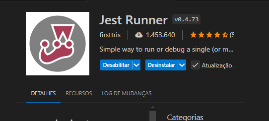
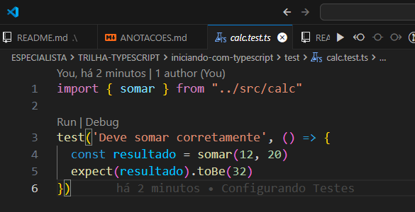
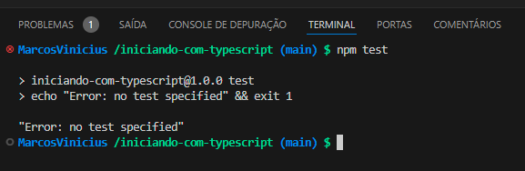
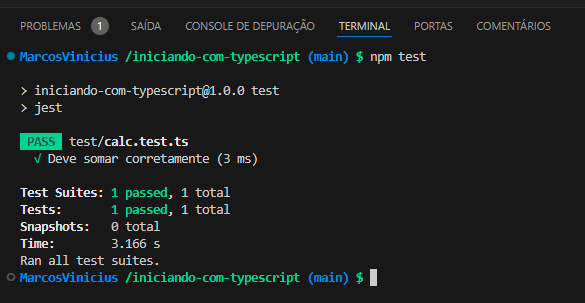

[< voltar](/README.md)

<h1 align='center'>Curso Formação DEV</h1>

***Este conteúdo faz parte do curso de Formação DEV da [COD3R](https://www.cod3r.com.br)***

<h1 align='center'>Módulo Especialista</h1>

## Introdução ao TypeScript

A Linguagem TypeScript nada mais é do que um super conjunto do JavaScript, com isso, tudo que o JavaScript tem está presente no TypeScript, sendo que o TypeScript acrescenta algumas funcionalidades a mais muito importantes que irão nos ajudar nos projetos.  

O TypeScript não é suportado nativamente pelos navegadores e nem pelo NodeJs, pois, precisa ser compilado (convertido) para JavaScript para que os navegadores e o NodeJs possa interpretar o código gerado.  

E o mais importante é que esse curso irá contemplar a parte de ***Programação Orientada a Objetos - POO***.  
POO é um paradigma de programação, é uma forma de pensar em como solucionar problemas de codificação utilizando este paradigma.  

Neste curso iremos abordar os fundamentos da ***Programação Orientada a Objetos - POO*** como: objetos, classes, atributos, métodos, etc.  
Iremos falar sobre os pilares da POO como: encapsulamento, herança e polimorfismo, com isso, este curso é duplamente importante contemplando TypeScript e POO.  

[^ Sumário ^](./README.md)

## Configuração Inicial do Projeto

Por padrão o NodeJs e nem o navegador, interpretam nativamente o TypeScript é preciso converter para JavaScript, então, precisamos fazer algumas configurações para que o projeto rode sem problemas.  

Antes de mais nada, se ainda não tem o NodeJs instalado e configurado em sua máquina, precisa entrar no [site](https://nodejs.org/pt) e baixar a versão LTS que estiver disponível para o seu Sistema Operacional (Windows, Linux ou MacOS).

Abra o terminal integrado do VSCode ou em um terminal externo ou pelo windows explorer *(onde achar mais fácil)* na pasta onde deseja salvar os projetos como por exemplo: ***C:/Projetos/CursoTypeScript/*** e rode o comando a seguir:  

- `mkdir iniciando-com-typescript`:  
Este comando serve para criar um diretório/pasta chamada ***"iniciando-com-typescript"*** no caminho do de exemplo acima.

- `cd iniciando-com-typescript`:
Esse comando serve para entrar na pasta que acabou de ser criada.  

- `npm init -y`:  
Comando do NodeJs que cria o package.json, que é o arquivo de configuração do projeto, onde, instalamos as dependências além de outras configurações relacionadas ao projeto, abaixo arquivo package.json gerado.  

  ```json
  {
    "name": "iniciando-com-typescript",
    "version": "1.0.0",
    "main": "index.js",
    "scripts": {
      "test": "echo \"Error: no test specified\" && exit 1"
    },
    "keywords": [],
    "author": "Marcos V R Pereira",
    "license": "ISC",
    "description": "Curso de TypeScript"
  }
  ```

  >> ***DICA:***  
  Se ainda não configurou o nome do autor do projeto no NPM, utilize o seguinte comando no terminal para adicionar: `npm set init-author-name "SEU NOME"`, assim, toda vez que rodar o comando ***npm ini -y*** o arquivo package.json já virá preenchido com seu nome.

- `code .`:  
Esse comando serve para abrir o VSCode dentro da pasta do projeto.  

  Agora já dentro do VSCode, podemos realizar algumas tarefas utilizando a interface gráfica.  
  Dentro do projeto ***"C:/Projetos/CursoTypeScript/iniciando-com-typescript/"*** crie uma pasta/diretório chamada `src/`que é onde serão salvos os códigos fonte do projeto.  
  Agora dentro de ***"src/"*** crie um arquivo chamado `index.ts` e dentro deste arquivo vamos criar um código simples que irá calcular um valor.  

  ```ts
  // index.ts

  const x: number = 3

  console.log(x);
  ```

  No código acima criamos uma constante `const` chamada `x` do tipo `number` que recebe `=` o valor `3`.  

  E por fim, vamos exibir na tela o valor da constante X através do comando `console.log(x)`.  

  O TypeScript ao contrário do JavaScript é uma linguagem fortemente tipada, com isso toda
  vez que declaramos uma constante, variável, etc, precisamos especificar seu ***TIPO*** com isso o código fica mais seguro.  

  >> ***OBS.:***  
  Não estaremos utilizando ponto e virgula ***";"*** no código pois acho melhor, mas nada impede que você use se assim quiser.  
  Eu por exemplo utilizo o plugin ***Prettier*** para formatar o código sem utilizar ***";"***.  

  Se tentar executar o código que criamos acima no terminal utilizando o comando `node src/index.ts`, lembrando que estamos no caminho ***"C:/Projetos/CursoTypeScript/iniciando-com-typescript/"*** tendo como resposta a saída no terminal informando que o NodeJs não reconhece a inicialização da constante utilizando ***dois pontos*** `const x:`.  

  Pois `const x: number` definindo o tipo da da constante, não é algo do JavaScript, mas sim do TypeScript e por padrão o NodeJs não consegue interpretar esse valor.

  <div align='center'></div>

[^ Sumário ^](./README.md)

## Instalando Dependências

Agora iremos instalar duas dependências para que o projeto TypeScript possa funcionar no NodeJs, para isso, abra o terminal na raiz do Projeto e rode o seguinte comando:  

```zsh
// Terminal

npm i -D typescript ts-node-dev @types/node
```

Agora vamos entender o que cada comando faz:  

- `npm`: é o comando que "busca" o pacote no site do [NPM](https://www.npmjs.com/) que é um repositório de diversos pacotes para diversas funcionalidades do NodeJs.  

- `i` ou `install`: é o parâmetro de instalação do pacote.  

- `-D`: se atente que é a letra "D" maiúscula, isso indica que o pacote será instalado como uma ***"Dependência de Desenvolvimento"*** e se omitir o "-D" será instalado como uma dependência de produção.  

- `typescript`: é o pacote que dá suporte ao TypeScript.  

- `ts-node-dev`: é o pacote que dá suporte a executar comando TypeScript no NodeJs.  

- `@types/node`: é o pacote que dá suporte aos Tipos do NodeJs, auxiliando na verificação dos comando na hora que estamos digitando.

>> ***DICA:***  
Existe um novo RunTime TypeScript chamado ***[DENO](https://deno.com/)*** que seria NODE escrito com as sílabas invertidas, é do mesmo criador do NODE "Ryan Dahl", mas ainda está em fase inicial.  
O DENO, interpreta nativamente o TypeScript sem a necessidade de se instalar pacotes externos e talvez mais a frente possamos ou não configurar ele no projeto.  

Com a execução desta linha de comando acima, instalamos as dependências de desenvolvimento resultando na atualização do arquivo `package.json` adicionando as `devDependencies:` como podemos ver a seguir:  

```json
// package.json

...
  "devDependencies": {
    "@types/node": "^22.7.4",
    "ts-node-dev": "^2.0.0",
    "typescript": "^5.6.2"
  }
}
```

[^ Sumário ^](./README.md)

## Criando o Arquivo de Configuração do TypeScript

Agora precisamos rodar mais um comando no terminal na raiz do projeto:  

```zsh
// Terminal

$ npx tsc --init
```

O comando acima cria o arquivo de configuração do TypeScript o `ts-config.ts`, depois de criando precisamos realizar uma alteração dentro do arquivo, para que os códigos compilados sejam criados dentro de uma pasta/diretório específica que em nosso caso será a `dist/`.  

Procure o parâmetro `ourDir: "./",` descomente a linha retirando o "#" do inicio e altere para `outDir: "dist",` que será nossa pasta de destino.  

Mais adiante podemos alterar mais alguma configuração neste arquivo, mas, por enquanto é só, salve as alterações e feche o arquivo.  

[^ Sumário ^](./README.md)

## Criando Scripts de Execução do Código

Agora iremos abrir novamente o arquivo `package.json` e adicionar dois Scripts que irão executar nosso código:  

- `"build": "tsc",`:  
Cria o script chamado ***"build"*** que quando executado irá compilar *(converter)* o código TypeScript e código JavaScript utilizando o comando ***"tsc"*** que significa TypeScript Compiler.  

  ```json
  // package.json

  ...
    "scripts": {
      "build": "tsc",
    },
  ...
  ```

  Executando o comando `npm run build` no terminal,

  ```zsh
  // Terminal

  $ npm run build
  ```

  será criado a pasta/diretório chamada `/dist` na raiz do projeto, contendo o arquivo compilado em JavaScript `index.js` contendo o seguinte conteúdo:  

  ```js
  // index.js

  "use strict";
  const x = 3;
  console.log(x);

  ```

  Com isso, se tentarmos rodar novamente o comando `node src/index.ts` ainda está retornando o mesmo erro que antes.  

  Mas, se executar-mos o comando para rodar o arquivo `index.js` que acabamos de compilar, ele irá retornar o valor da variável sem nenhum erro, então, execute o comando `node dist/index.js` no terminal e verifique o resultado:  

  <div align='center'></div>

- `"dev": "ts-node-dev --respawn src/index.ts,`:  
Acima criamos um script chamado "dev" que executa os seguintes comando:  

  - `ts-node-dev`: pacote instalado anteriormente;  

  - `--respawn`: comando que observa alterações realizadas no arquivo e executa novamente toda vez que houver alterações e o arquivo for salvo;  

  - `src/index.ts`: caminho do arquivo que será executado.  
  
  ```json
  // package.json
  
  ...
    "scripts": {
    "build": "tsc",
    "dev": "ts-node-dev --respawn src/index.ts",
  }
  ...
  ```
  
Para ver o que acontece, abra o terminal na raiz do projeto e execute o comando `npm run dev` confira o resultado.  

```zsh
// Terminal

$ npm run dev
```

Como podemos ver a seguir, o código TypeScript é interpretado corretamente pelo NodeJs retornado o valor da constante ***"3"*** e continua em execução esperando alguma alteração no arquivo para exibir o novo resultado.  

<div align="center"></div>

Para confirmar que o comando continua observando alterações no arquivo `index.ts`, vamos realizar uma pequena alteração no código e salver para confirmar:  

```ts
// index.ts

const x: number = 3

console.log(x * 7);
```

Como podemos observar na imagem abaixo, após a alteração no código, o script restartou exibindo o novo resultado ***"21"***.  

<div align='center'></div>

E para encerrar o comando, basta digitar a combinação de teclas `Ctrl + D`, caso esteja utilizando o windows.  

[^ Sumário ^](./README.md)

## Configurando Testes - JEST

Agora iremos instalar duas dependências para que possamos realizar testes no projeto. O pacote de teste que iremos utilizar é o Jest, para isso, abra o terminal na raiz do Projeto e rode o seguinte comando:  

```zsh
// Terminal

npm i -D jest ts-jest @types/jest
```

Agora vamos entender o que cada comando faz:  

- `npm`: é o comando que "busca" o pacote no site do [NPM](https://www.npmjs.com/) que é um repositório de diversos pacotes para diversas funcionalidades do NodeJs.  

- `i` ou `install`: é o parâmetro de instalação do pacote.  

- `-D`: se atente que é a letra "D" maiúscula, isso indica que o pacote será instalado como uma ***"Dependência de Desenvolvimento"*** e se omitir o "-D" será instalado como uma dependência de produção.  

- `jest`: é o pacote que dá suporte ao Jest.  

- `ts-jest`: é o pacote que dá suporte a executar comando TypeScript no Jest.  

- `@types/jest`: é o pacote que dá suporte aos Tipos do Jest, auxiliando na verificação dos comando na hora que estamos digitando.

  Com a execução desta linha de comando acima, instalamos as dependências de desenvolvimento resultando na atualização do arquivo `package.json` adicionando as `devDependencies:` como podemos ver a seguir:

  ```json
  // package.json

  ...
    "devDependencies": {
      "@types/jest": "^29.5.13",
      "jest": "^29.7.0",
      "ts-jest": "^29.2.5",
  ...
  ```

O próximo passo é criar um arquivo de configuração para o Jest, para isso, acesse a raiz do projeto no caminho ***"C:/Projetos/CursoTypeScript/iniciando-com-typescript/"*** e crie um arquivo chamado `jest.config.js` e dentro deste arquivo adicione o conteúdo a seguir:  

```js
// jest.config.js

module.exports = {
  preset: "ts-jest",
  testEnvironment: "node"
}
```

Agora vamos entender o que cada parte do código faz:  

- `module.exports = {`: comando JavaScript que exporta um módulo NodeJs, criando um Objeto com as definições do Módulo Jest.  

  - `preset: "ts-jest,"`: que é o pacote que acabou de ser instalado.  

  - `testEnvironment: "node"`: define o ambiente de teste que neste cado é o NodeJs.

- `}`: fecha o Objeto com as definições do Módulo Jest.  

  >> ***DICA:***  
  Instale a extensão ***Jest Runner*** no VSCode para facilitar a criação de testes visualmente.  

  <div align='center'></div>

Com isso, temos o arquivo de configuração do Jest finalizado, mas, ainda precisamos criar a pasta/diretório onde serão criados os arquivos de test.  

Então, dentro da pasta/diretório raiz do projeto, crie uma pasta chamada `test/`.  

Agora para que possamos verificar se tudo está funcionando perfeitamente, então, dentro de `src/`, vamos criar um arquivo de teste temporário chamado `calc.ts` que poderá ser deletado posteriormente.  

Dentro deste arquivo, iremos adicionar o código abaixo que realiza uma SOMA entre dois números:  

```ts
// calc.ts

export function somar(a: number, b: number): number {
  return a + b
}

```

Agora que já temos um arquivo que contém uma função, podemos criar o arquivo de teste, então, dentro da pasta/diretório chamada `test/`que está dentro da raiz do projeto, crie um arquivo chamado `calc.test.ts`, observe que para que o sistema reconheça que o arquivo é um arquivo de teste, ele precisa ter o mesmo nome do arquivo que será testado acrescentando o termo ***".test"*** e terminando com a extensão ***".ts"***

>> ***BOA PRÁTICA:***  
Uma boa prática é respeitar a mesma estrutura de pastas do projeto dentro da pasta de `test/`para facilitar a identificação dos arquivos visualmente.  

Agora vamos definir os testes no arquivo `calc.test.ts`:  

```ts
// calc.test.ts

import { somar } from "../src/calc"

test('Deve somar corretamente', () => {
  const resultado = somar(12, 20)
  expect(resultado).toBe(32)
})
```

Agora que já temos o arquivo de test, com o test da função `somar()` definida dentro dele, podemos realizar o teste de duas formas:  

- A primeira forma é clicando em ***"Run"*** que aparece logo acima da palavra ***"test"*** no VSCode:  

  <div align='center'></div>

- A outra forma é via terminal, então abra o terminal integrado do VSCode com "Ctrl + ' " ou um terminal externo (ambos precisam estar na raiz do projeto) e digite o comando a seguir:  

  ```zsh
  // Terminal

  $ npm test
  ```
  
  <div align='center'></div>
  
  Em nosso caso o comando vai falhar, pois precisamos configurar o script de teste `"test": "jest"` no arquivo `package.json`, então abra e altere com as informações a seguir:  
  
  ```json
  // package.json
  
  ...
    "scripts": {
    "build": "tsc",
    "dev": "ts-node-dev --respawn src/index.ts",
    "test": "jest"
  },
  ...
  ```

  Agora, realize o teste novamente no terminal:

  ```zsh
  // Terminal

  $ npm test
  ```
  
  <div align='center'></div>
  
  Como podemos confirmar, o teste foi executado corretamente.
