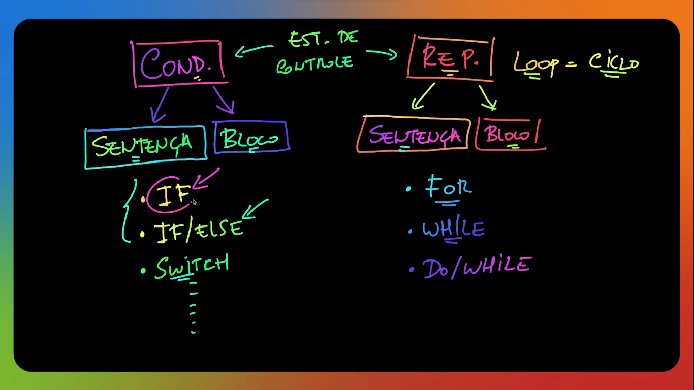
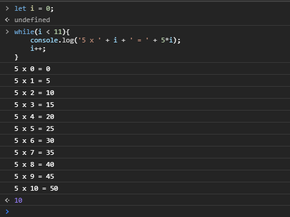
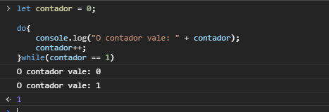
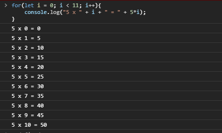
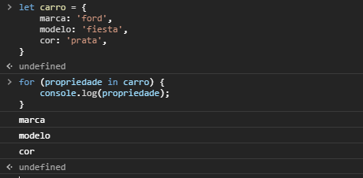
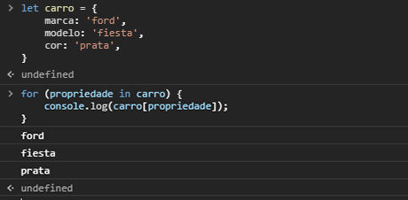
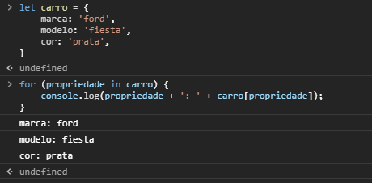
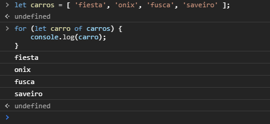
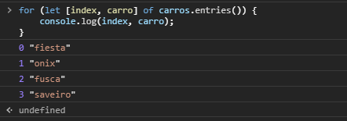

# ESTRUTURAS DE CONTROLE



## Estruturas Condicionais

As estruturas condicionais permitem que um programa execute diferentes comandos de acordo com as condições estabelecidas. Elas estão presentes em diversas linguagens de programação e todo profissional da área precisa saber como utilizá-las.  

Em geral, o funcionamento das estruturas condicionais depende apenas de um algoritmo simples iniciado pelo comando ***‘if’***. Nele, ainda é preciso declarar a condição que será analisada e os blocos de comando que o programa executará em cada cenário possível. E é justamente de acordo com o número de possibilidades que as estruturas condicionais são classificadas em ***simples*** e ***compostas***.  

### Estruturas Condicionais Simples  

São aquelas em que é preciso declarar apenas o que será executado caso a condição definida seja satisfeita. Isso quer dizer que, se o retorno da condicional for negativo, sua execução é apenas encerrada e o algoritmo prossegue para interpretar as linhas de código presentes após o final da estrutura.  

### Estruturas Condicionais Compostas  

Permitem que sejam programados um comportamento para quando o retorno for positivo e outro diferente para quando a pendência não for satisfeita. Essa segunda possibilidade é representada pelo comando ***‘else’***, que é declarado após o fechamento do primeiro caso.  

Se a intenção for contar com mais de dois possíveis retornos, dá ainda para recorrer às ***estruturas condicionais encadeadas***. Dessa forma, podem ser testadas quantas condições forem necessárias ao projeto, ampliando bastante o poder dessa importante ferramenta de desenvolvimento. O encadeamento acontece apenas declarando um novo ***‘if’*** logo após o comando ***‘else’***. O detalhe é que, nesses casos, a rotina do ‘else’ deve ser registrada em código apenas na última estrutura encadeada.  

```js
if (condição 1) {
    bloco para condição 1 'true';
 } else if (condição 2) {
    bloco para condição 2 'true';
 } else {
    bloco para condição 'false';
 }
```

Vale também destacar que, nas estruturas condicionais, é possível utilizar dados de diferentes tipos ao escrever as condições, como ***strings*** e ***números***. Durante a execução, no entanto, todas essas informações são interpretadas como valores lógicos — ou seja, ***‘true’*** ou ***‘false’*** (verdadeiro ou falso) — para que seja possível definir qual trecho do código será executado.  

### Switch/Case

A estrutura condicional switch permite executar um bloco de código diferente de acordo com cada opção (cada ***case***) especificada. Seu uso é indicado quando os valores a serem analisados nessas condições são pré-definidos.  

O valor atribuído à variável mensagem será: *“Boas festas, meu amigo!”*.

```js
var tipoUsuario = "Gerente";

switch (tipoUsuario) {
    case "Admin":
        mensagem = "*|*| Feliz Natal, chefe! |*|*";
        break;
    case "Gerente":
        mensagem = "Boas festas, meu amigo!";
        break;
    default:
        mensagem = "Boas festas!";
}
```

## Estruturas de Repetição

As estruturas de repetição, são úteis quando precisamos repetir N vezes a execução de um bloco de comandos até que uma condição seja atendida.  

### While (enquanto)

Podemos utilizar a estrutura de repetição ***while*** caso seja necessário repetir um bloco de comandos por ***N*** vezes.  

```js
let i = 0;
while(i < 11){
    console.log('5 x ' + i + ' = ' + 5 * i);
    i++;
}
```  

A sintaxe do ***while***, como vemos no exemplo acima, é bem simples. Utilizamos a palavra reservada `while` , logo em seguida precisamos passar uma condição que será atendida enquanto ela retornar `true`, ou seja, ***verdadeiro***.

Neste caso, simulamos a tabuada do ***5***, a variável `i` é o nosso contador, iniciamos ela com o valor `0`, portanto a condição será verdadeira até que ela atinja o valor `11`, e por isso ela é iterada a cada repetição - `i++`, ao atingir tal valor o laço é quebrado.

Executando o código acima teremos o seguinte resultado:  

<div align='center'>



</div>

### Do-While (fazer enquanto)

O ***do-while*** tem o mesmo conceito que o while com uma única diferença, a condição é verificada após os comandos do bloco serem executados, ou seja, mesmo que a condição seja falsa, é garantia que o bloco será executado ao menos uma vez.

Podemos testar da seguinte forma:  

```js
let contador = 0;

do{
    console.log("O contador vale: " + contador);
 contador++;
}while(contador == 1)

```

A variável contador foi inicializada com o valor `0` e o `while` está com a condição `contador == 1` ou seja, a condição é `falsa` e utilizando o while nosso bloco de comandos não seria executado. Porém podemos perceber que ao utilizar `do-while`, o bloco vem antes da verificação da condição, com isso ele garante que o bloco de comandos seja executado ao menos uma vez.  

Desta forma vamos obter o seguinte comportamento:  

<div align='center'>



</div>

### For (para)

A estrutura de repetição `for` segue o mesmo princípio que o ***while***, porém este recurso é mais utilizado quando se sabe o número de iterações da repetição, como ao percorrer um vetor, por exemplo.

Podemos replicar o exemplo acima da tabuada, porém utilizando for:  

```js
for(let i = 0; i < 11; i++){
    console.log("5 x " + i + " = " + 5 * i);
}
```  

Para utilizar o ***for***, usamos a palavra-chave `for` seguida de três declarações, primeiramente iniciamos a ***variável*** que será o controlador do nosso ***laço de repetição***, logo em seguida precisamos informar a ***condição a ser atendida*** e, por último, uma ***expressão*** que será executado ao final de cada iteração do `for`, normalmente utilizamos para incrementar a variável que será utilizada como controlador do nosso laço.  

Ao executar o código teremos o resultado semelhante ao exemplo utilizando while:  

<div align='center'>



</div>

>***DICA:*** Vale ressaltar que o `while` é mais indicado para situações onde não temos conhecimento do número de iterações do laço, já o ***for*** é mais adequado para situações que o número de iterações está definido previamente.  

### Utilizando for…in (para dentro)

O `for…in` é utilizado para percorrer as propriedades de um objeto, por exemplo:  

```js
let carro = {
    marca: 'ford',
modelo: 'fiesta',
cor: 'prata',
}

for (propriedade in carro) {
    console.log(propriedade);
}
```  

Criamos uma ***instância do objeto*** `carro`, onde temos como ***propriedade*** a `marca, modelo e cor`.  

Ao utilizar o `for`, passamos a variável `propriedade` que irá percorrer as propriedades do objeto e logo em seguida, passamos o objeto `carro`.  

O resultado esperado:  

<div align='center'>



</div>

Também podemos acessar os ***atributos*** de cada propriedade, para isso basta usarmos `propriedade` como índice do nosso objeto, desta maneira:  

```js
for (propriedade in carro) {
    console.log(carro[propriedade]);
}
```

Vamos obter a seguinte saída:  

<div align='center'>



</div>

E por fim, podemos exibir o objeto por completo somente usando o ***for…in***:  

```js
for (propriedade in carro) {
    console.log(propriedade + ': ' + carro[propriedade]);
}
```

Vamos obter a seguinte saída:  

<div align='center'>



</div>

### Utilizando for…of (para de)

O `for…of` nós podemos utilizar para percorrer objetos iteráveis como `Maps, Sets e Vetores` de forma simples e eficaz, da seguinte forma:  

```js
let carros = [ 'fiesta', 'ônix', 'fusca', 'saveiro' ];

for (let carro of carros) {
    console.log(carro);
}
```

Neste caso, vamos obter os valores de cada índice:  

<div align='center'>



</div>

Também é possível exibir o índice referente a cada item usando o método `entries()` da seguinte forma:  

```js
for (let [index, carro] of carros.entries()) {
    console.log(index, carro);
}
```

Desta maneira vamos obter os índices e os respectivos valores:  

<div align='center'>



</div>
