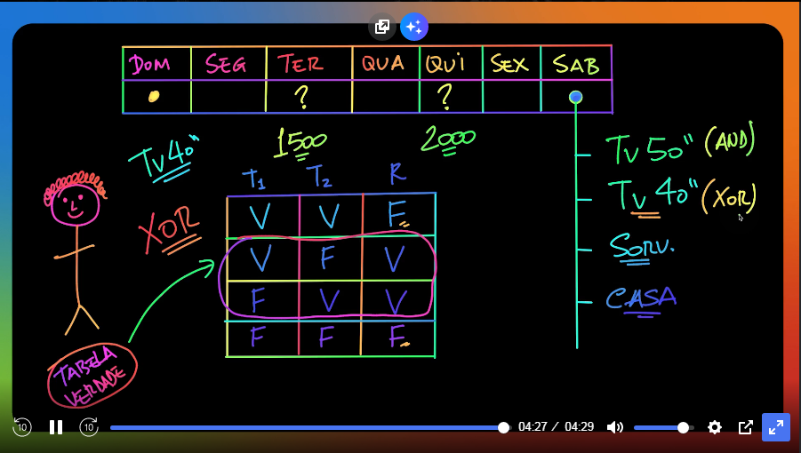
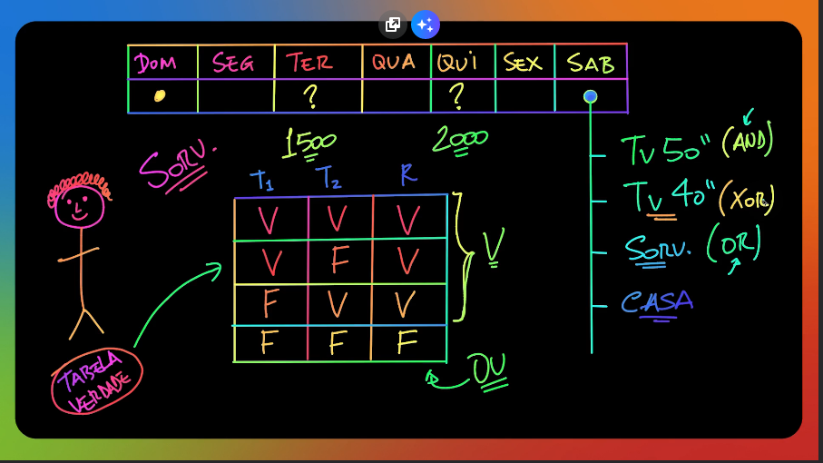
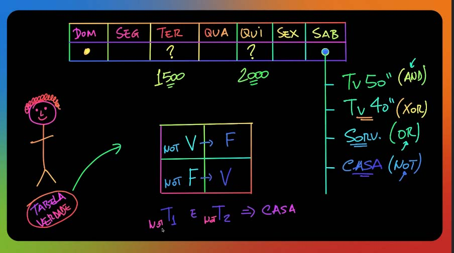

<!-- 
 !        OPERADORES LÓGICOS
 ! ================================
 
 * Operador Lógico 'E / AND'
 Retornará 'VERDADEIRO / TRUE', 
 Somente se 'TODAS' as respostas sejam verdadeiras;
 
 * Caso I:
 todo: (Está na Black Friday?) E (Tem produto no estoque?)
       se a resposta for verdadeira 'TRUE' para as duas perguntas
 ?     então, (O desconto pode ser aplicado e a venda realizada.)
 
 * Caso II:
 todo: (Tem saldo na conta de origem?) E (A conta destino é válida?) E (está em horário comercial?)
       se a resposta for verdadeira 'TRUE' para as tres perguntas
 ?     então, (a transferência pode ser concluída.)
 
 * Caso III:
 todo: (O aluno concluiu as aulas?) E (Acertou mais de 80% das aulas?) E (Tirou Média acima de 70%?)
       se a resposta for verdadeira 'TRUE' para as tres perguntas
 ?     então, (O aluno passou e pode imprimir o Certificado.)
 
 * Operador Lógico 'OU / OR' 
 Retornará 'VERDADEIRO / TRUE',
 caso 'UMA' das respostas forem verdadeiras.
 * Obs.: caso existam 'n' perguntas e 'UMA' for verdadeira,
 *       então, o retorno será VERDADEIRO 'TRUE'
 
 * Caso I:
 todo: (O produto é frágil?) OU (O produto é de alto custo?)
       se a resposta for verdadeira 'TRUE' para uma das perguntas
 ?     então, (O seguro do frete deverá ser contratado.)
 
 * Caso II:
 todo: (O usuário é um Administrador?) OU (O o usuário é um Moderador?)
       se a resposta for verdadeira 'TRUE' para uma das perguntas
 ?     então, (O usuário pode excluir uma postagem do Forum.)
 
 * Operador Lógico 'OU EXCLUSIVO / XOR'
 Retornará 'VERDADEIRO / TRUE',
 Somente se 'UMA' das respostas forem verdadeiras.
 -->

## TABELA VERDADE

### Operador Lógico E 'AND'

### Operador Lógico OU Exclusivo 'XOR'

### Operador Lógico OU 'OR'

### Operador Lógico NEGAÇÃO LÓGICA 'NOT'

